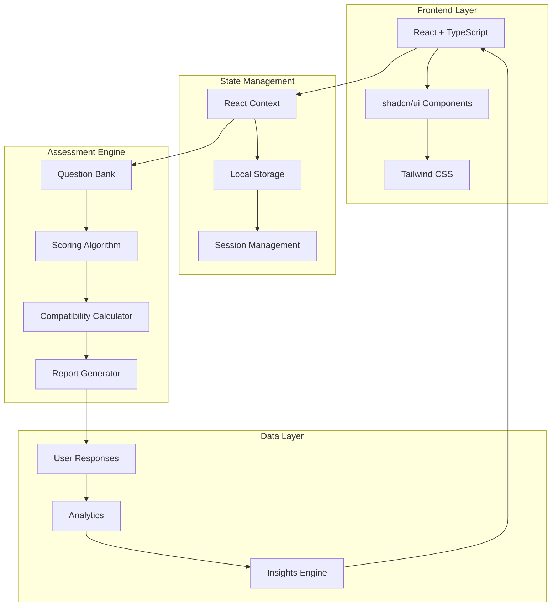
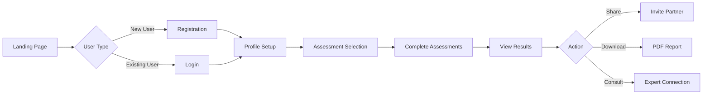

# 💍 Pre-Marriage Compatibility Assessment Platform

<div align="center">
  
  
  
  
  
  
  
  
  <h3>🎯 A Modern Web Application for Couples to Assess Their Compatibility Before Marriage</h3>
  
  [Live Demo](https://lovable.dev/projects/3acd99c3-d680-4dc3-bca4-795980f0aceb) • [Report Bug](https://github.com/Yash-Kavaiya/pre-marriage-compatibility/issues) • [Request Feature](https://github.com/Yash-Kavaiya/pre-marriage-compatibility/issues)

</div>

---

## 📋 Table of Contents

- [About The Project](#-about-the-project)
- [Key Features](#-key-features)
- [Compatibility Assessment Areas](#-compatibility-assessment-areas)
- [System Architecture](#-system-architecture)
- [Technology Stack](#-technology-stack)
- [Getting Started](#-getting-started)
- [Usage](#-usage)
- [API Documentation](#-api-documentation)
- [Contributing](#-contributing)
- [Roadmap](#-roadmap)
- [License](#-license)
- [Contact](#-contact)
- [Acknowledgments](#-acknowledgments)

## 🌟 About The Project

The **Pre-Marriage Compatibility Assessment Platform** is a comprehensive web application designed to help couples evaluate their compatibility across multiple dimensions before making the life-changing decision of marriage. Using modern psychological assessment techniques and data-driven insights, this platform provides couples with valuable feedback about their relationship dynamics.

### 🎯 Mission Statement

> To empower couples with data-driven insights and comprehensive assessments that promote healthy, lasting relationships through informed decision-making.

## ✨ Key Features

| Feature | Description | Status |
|---------|-------------|--------|
| 🧠 **Personality Assessment** | Advanced personality matching using Big Five model | ✅ Completed |
| 💰 **Financial Compatibility** | Evaluate spending habits and financial goals | ✅ Completed |
| 👨‍👩‍👧 **Family Values Alignment** | Assess views on family, children, and traditions | ✅ Completed |
| 💼 **Career Goals Analysis** | Compare professional aspirations and work-life balance | ✅ Completed |
| 🏠 **Lifestyle Preferences** | Match daily routines, hobbies, and social preferences | ✅ Completed |
| 💬 **Communication Style** | Analyze communication patterns and conflict resolution | 🚧 In Progress |
| 🎯 **Goal Alignment** | Short-term and long-term life goals comparison | 🚧 In Progress |
| 📊 **Detailed Reports** | Comprehensive PDF reports with recommendations | 📅 Planned |
| 🔐 **Privacy & Security** | End-to-end encryption for sensitive data | ✅ Completed |

## 💑 Compatibility Assessment Areas

### Comprehensive Assessment Matrix

| Assessment Area | Factors Evaluated | Weight | Scoring Method |
|-----------------|-------------------|--------|----------------|
| **Emotional Compatibility** | Emotional intelligence, empathy, support systems | 20% | Likert Scale (1-5) |
| **Intellectual Compatibility** | Education values, curiosity, decision-making | 15% | Multiple Choice |
| **Physical Compatibility** | Health priorities, activity levels, intimacy views | 10% | Range Selection |
| **Social Compatibility** | Social preferences, friend circles, networking | 10% | Binary & Scale |
| **Cultural Compatibility** | Traditions, religious views, cultural practices | 15% | Weighted Options |
| **Financial Compatibility** | Spending habits, saving goals, investment views | 15% | Numerical Input |
| **Life Goals Compatibility** | Career, family planning, retirement | 15% | Priority Ranking |

### Scoring Interpretation

| Overall Score | Compatibility Level | Recommendation |
|---------------|-------------------|----------------|
| 90-100% | Excellent Match | Strong foundation for marriage |
| 75-89% | Good Match | Minor areas for discussion |
| 60-74% | Moderate Match | Several areas need attention |
| 45-59% | Challenging Match | Significant work needed |
| Below 45% | Low Compatibility | Professional counseling recommended |

## 🏗️ System Architecture



## 🛠️ Technology Stack

### Frontend Technologies

| Technology | Version | Purpose |
|------------|---------|---------|
| **React** | 18.x | UI Framework |
| **TypeScript** | 5.x | Type Safety |
| **Vite** | 5.x | Build Tool |
| **Tailwind CSS** | 3.x | Styling |
| **shadcn/ui** | Latest | Component Library |
| **React Router** | 6.x | Navigation |
| **React Hook Form** | 7.x | Form Management |
| **Zod** | 3.x | Schema Validation |

### Development Tools

| Tool | Purpose |
|------|---------|
| **ESLint** | Code Linting |
| **Prettier** | Code Formatting |
| **Husky** | Git Hooks |
| **Commitizen** | Commit Standards |

## 🚀 Getting Started

### Prerequisites

Before you begin, ensure you have the following installed:

- **Node.js** (v18.0.0 or higher)
- **npm** or **yarn** package manager
- **Git** for version control

### Installation

1. **Clone the repository**
   ```bash
   git clone https://github.com/Yash-Kavaiya/pre-marriage-compatibility.git
   cd pre-marriage-compatibility
   ```

2. **Install dependencies**
   ```bash
   npm install
   # or
   yarn install
   ```

3. **Set up environment variables**
   ```bash
   cp .env.example .env.local
   ```
   Edit `.env.local` with your configuration:
   ```env
   VITE_API_URL=your_api_url
   VITE_ANALYTICS_ID=your_analytics_id
   ```

4. **Start the development server**
   ```bash
   npm run dev
   # or
   yarn dev
   ```

5. **Open your browser**
   Navigate to `http://localhost:5173`

### Building for Production

```bash
npm run build
# or
yarn build
```

## 📖 Usage

### User Flow Diagram



### Assessment Process

1. **Create Account**: Register with email and create a secure profile
2. **Complete Profile**: Add basic information about yourself
3. **Take Assessments**: Complete various compatibility assessments
4. **Invite Partner**: Share assessment link with your partner
5. **Compare Results**: View combined compatibility scores
6. **Get Recommendations**: Receive personalized advice and resources

## 📡 API Documentation

### Assessment Endpoints

| Method | Endpoint | Description |
|--------|----------|-------------|
| `GET` | `/api/assessments` | List all assessments |
| `POST` | `/api/assessments/:id/start` | Start an assessment |
| `POST` | `/api/assessments/:id/submit` | Submit assessment |
| `GET` | `/api/results/:userId` | Get user results |
| `POST` | `/api/results/compare` | Compare couple results |

### Example Request

```javascript
// Start Assessment
const startAssessment = async (assessmentId) => {
  const response = await fetch(`/api/assessments/${assessmentId}/start`, {
    method: 'POST',
    headers: {
      'Content-Type': 'application/json',
      'Authorization': `Bearer ${token}`
    }
  });
  return response.json();
};
```

## 🤝 Contributing

We welcome contributions from the community! Please follow these steps:

1. **Fork the Project**
2. **Create your Feature Branch**
   ```bash
   git checkout -b feature/AmazingFeature
   ```
3. **Commit your Changes**
   ```bash
   git commit -m 'Add some AmazingFeature'
   ```
4. **Push to the Branch**
   ```bash
   git push origin feature/AmazingFeature
   ```
5. **Open a Pull Request**

### Contribution Guidelines

- Follow the existing code style
- Write meaningful commit messages
- Add tests for new features
- Update documentation as needed
- Ensure all tests pass before submitting PR

## 🗺️ Roadmap

### Phase 1: Core Features (Q1 2025) ✅
- [x] Basic assessment framework
- [x] User authentication
- [x] Core compatibility assessments
- [x] Results visualization

### Phase 2: Enhanced Features (Q2 2025) 🚧
- [ ] AI-powered insights
- [ ] Video consultation integration
- [ ] Mobile application
- [ ] Multi-language support

### Phase 3: Advanced Features (Q3 2025) 📅
- [ ] Relationship coaching modules
- [ ] Community forums
- [ ] Success stories section
- [ ] Partner API integrations

### Phase 4: Scale & Optimize (Q4 2025) 📅
- [ ] Machine learning improvements
- [ ] Global expansion
- [ ] Enterprise solutions
- [ ] Research publications

## 📄 License

This project is licensed under the MIT License - see the [LICENSE](LICENSE) file for details.

## 📞 Contact

**Yash Kavaiya**
- 🔗 LinkedIn: [linkedin.com/in/yashkavaiya](https://linkedin.com/in/yashkavaiya)
- 📧 Email: yash.kavaiya3@gmail.com
- 🐦 Twitter: [@Yash_Kavaiya_](https://twitter.com/Yash_Kavaiya_)
- 📝 Medium: [medium.com/@yash.kavaiya3](https://medium.com/@yash.kavaiya3)
- 🏆 Kaggle: [kaggle.com/yashkavaiya](https://www.kaggle.com/yashkavaiya)
- 🌐 Portfolio: [aspecta.id/u/Yash-Kavaiya](https://aspecta.id/u/Yash-Kavaiya)

### Project Links
- 🌐 **Live Application**: [Lovable Platform](https://lovable.dev/projects/3acd99c3-d680-4dc3-bca4-795980f0aceb)
- 📚 **Documentation**: [GitHub Wiki](https://github.com/Yash-Kavaiya/pre-marriage-compatibility/wiki)
- 🐛 **Issue Tracker**: [GitHub Issues](https://github.com/Yash-Kavaiya/pre-marriage-compatibility/issues)

## 🙏 Acknowledgments

- [React Documentation](https://react.dev)
- [shadcn/ui](https://ui.shadcn.com)
- [Tailwind CSS](https://tailwindcss.com)
- [Vite](https://vitejs.dev)
- [Lovable Platform](https://lovable.dev)
- All contributors and supporters of this project

---

<div align="center">
  
  **Made with ❤️ by [Yash Kavaiya](https://github.com/Yash-Kavaiya)**
  
  ⭐ Star this repository if you find it helpful!
  
</div>
